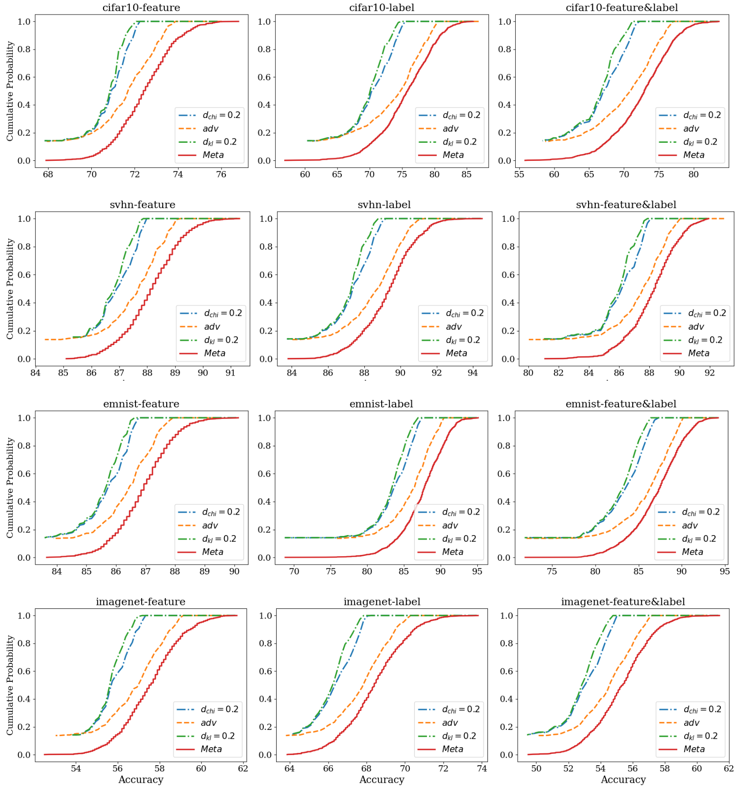
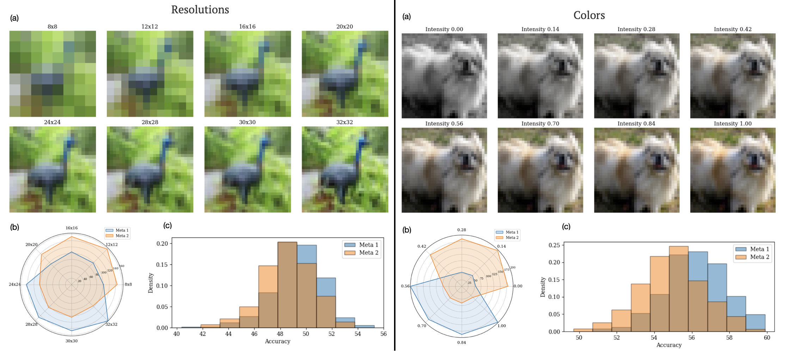
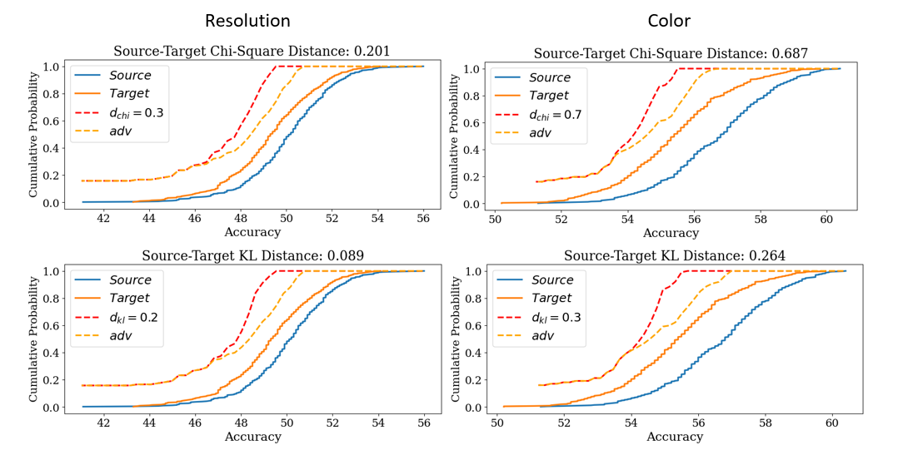

# <p align="center">Theoretical Bounds for Robust Model Evaluation over Federated Networks</p>
## Introduction
This repository contains the code for the paper [Theoretical Bounds for Robust Model Evaluation over Federated Networks]
## Abstract
Consider a network of clients with private, non-IID local datasets governed by an unknown meta-distribution. A central server aims to evaluate the average performance of a given ML model, not only on this network (standard beta or A/B testing) but also on all possible unseen networks that are meta-distributionally similar to it, as measured by either $f$-divergence or Wasserstein distance. To this end, we propose a novel robust optimization framework that can be implemented in a private and federated manner with at most polynomial time and query complexity. Specifically, we introduce a private server-side aggregation technique for local adversarial risks, which provably enables a global robust evaluation of the model. We also establish asymptotically minimax-optimal bounds for the risk average and CDF, with vanishing generalization gaps as the source network size $K$ grows and the minimum local dataset size exceeds $\mathcal{O}\left(\log K\right)$. Empirical results further validate the effectiveness of our bounds in real-world tasks.
## Empirical CDF Plot with DKW Bound

Use empirical_cdf_dkw_plot.py script to compute the empirical cumulative distribution function (CDF) for a column of accuracy values from a CSV file.  
It also uses the Dvoretzky–Kiefer–Wolfowitz (DKW) inequality to create upper and lower bounds, giving a confidence band.


### Command-Line Arguments

**Usage:**  
```bash
python empirical_cdf_dkw_plot.py <csv_file> <target_cdf> [--delta <delta>]
```

**Arguments:**

- `csv_file` (str)  ✅ **Required**  
  Path to the CSV file containing your accuracy data.  
  The file must include a column named `'accuracy'` with float values (e.g., 0.76, 0.81, etc.).

- `target_cdf` (float)  ✅ **Required**  
  A value between 0 and 1 representing the cumulative distribution function (CDF) value you're interested in.  
  The script uses the DKW bound to estimate the range of accuracy values corresponding to this CDF value.

- `--delta` (float)  ❌ **Optional**  
  Sets the confidence level for the DKW bound.  
  Default is `0.05`, which corresponds to a 95% confidence band.  
  Smaller values (e.g., `0.01`) produce tighter bands but require more certainty.

### Example Usage

```bash
python empirical_cdf_dkw_plot.py data/example_data.csv 0.8
python empirical_cdf_dkw_plot.py data/example_data.csv 0.8 --delta 0.01
```

### Outputs

- Prints the estimated accuracy range corresponding to the given CDF using the DKW bound.  
- Saves the plot as `dkw_plot.png` in the current directory.
## Results
###  Client Generation and Risk CDF Certificates for Unseen Clients
<p align="center">
  
</p>

### Certificates for f-Divergence Meta-Distributional Shifts
<p align="center">
  
</p>

<p align="center">
  
</p>
